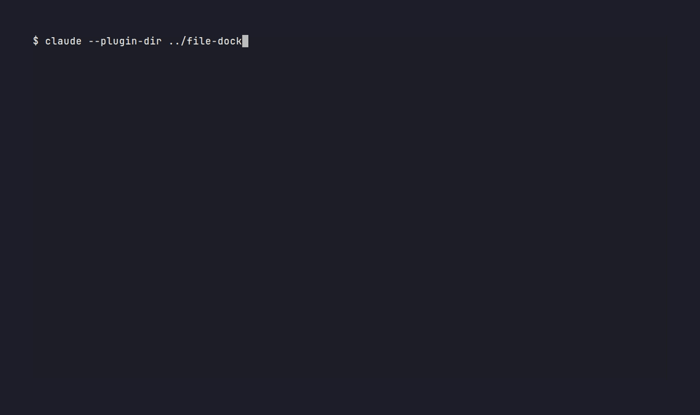

# file-dock

**Claude가 말한 경로가 입력창 위 버튼이 됩니다. 누르면 그 PC의 기본 프로그램이나 파일 탐색기로 바로 열립니다.**

[마켓플레이스](../../README.md) · [플러그인 소스](.)



Claude Code [mods](https://code.claude.com/docs/en/plugins/mods/)로 만든 플러그인입니다. Claude Code 2.1.287 이상이 필요합니다.

## 설치

```text
/plugin marketplace add Changroro/plugins
/plugin install file-dock@changroro
/reload-plugins
```

## 버튼이 생기는 경로

| 구분 | 대상 | 바뀌는 시점 |
|---|---|---|
| 나 | 붙여넣은 이미지(`[Image #1]`) | 입력창에서 지우면 사라지고, `/clear` 하면 비워짐 |
| 나 | 내가 프롬프트에 적은 파일·폴더 경로 | 대화 동안 쌓이며 최근 5개 표시 |
| Claude | 마지막 답변에 나온 파일·폴더 경로, 그 턴에 Claude가 Write·Edit로 만든 파일 | 답변마다 새로 바뀜 |

절대 경로, 상대 경로, `~/…`, Windows `C:\…`, `file://…`, 따옴표·백틱·굵게 표시 안의 경로를 인식합니다. 실제로 존재하는 파일과 폴더만 버튼이 됩니다. 파일은 문서·이미지·영상·음성 확장자(pdf, hwp, docx, pptx, xlsx, md, png, jpg, mp4 등)만 대상으로 하고, 코드 파일은 버튼으로 만들지 않습니다.

## 여는 방법

버튼을 클릭하거나, `ctrl+x tab`으로 입력창 위 띠로 이동한 뒤 방향키와 Enter로 누릅니다. 성공하면 `📂 이름 열었습니다` 알림이 뜹니다.

| OS | 여는 명령 |
|---|---|
| Linux | `xdg-open` |
| macOS | `open` |
| Windows | `rundll32 url.dll,FileProtocolHandler` |

## 접근 범위

- 읽기: 경로가 실제로 있는지와 종류(파일·폴더), Claude Code가 붙여넣은 이미지를 두는 임시 폴더 목록, 입력창 내용(붙여넣은 이미지 번호 확인용)
- 실행: OS 판별용 `uname -s`, `id -u`, 그리고 버튼을 눌렀을 때 위의 여는 명령
- 쓰기·네트워크·모델 호출: 없음

## 알려진 한계

- Linux에서 실제로 확인했고, macOS·Windows는 테스트로만 확인했습니다.
- 붙여넣은 이미지 위치는 Claude Code 내부 규칙(`<임시 폴더>/claude-<uid>/<프로젝트>/<세션>/images/`)을 따릅니다. Claude Code가 이 규칙을 바꾸면 이미지 버튼이 뜨지 않을 수 있습니다.
- 공백이 든 경로를 따옴표 없이 쓰면 공백 앞에서 끊겨 버튼이 생기지 않을 수 있습니다.

## 개발

```sh
claude plugin validate --strict plugins/file-dock
claude plugin test plugins/file-dock
claude --plugin-dir ./plugins/file-dock
```

데모 GIF는 `demo/file-dock.tape`를 [VHS](https://github.com/charmbracelet/vhs)로 녹화했습니다.
